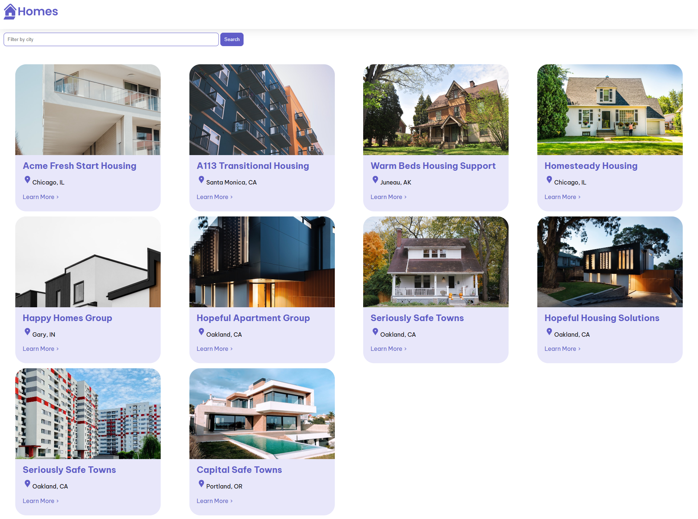

## Projet Angular - Résumé du Tutoriel

### Description du Projet
Ce projet a été réalisé en suivant le tutoriel officiel d'Angular. Il met en œuvre les principaux concepts Angular, notamment :
- **Composants** : Structure de base pour diviser l'interface utilisateur.
- **Templates et Directives** : Utilisation de *ngFor et *ngIf pour afficher dynamiquement les données.
- **Services** : Récupération et gestion des données depuis un fichier JSON ou une API.
- **Routing** : Configuration des routes pour naviguer entre les pages.

### Fonctionnalités
- Affichage d'une liste dynamique d'éléments.
- Gestion des états (affichage conditionnel).
- Structure modulaire du projet.

### Technologies Utilisées
- **Framework** : Angular (v15+)
- **Langage** : TypeScript
- **CSS Framework** : Bootstrap ou TailwindCSS (optionnel)
- **API/JSON** : Données locales ou APIs gratuites (comme DummyJSON).

### Prérequis
- Node.js installé
- Angular CLI installé :
```bash
npm install -g @angular/cli
```

### Lancer le Projet
1. Installer les dépendances :
```bash
npm install
```
2. - Démarrer le serveur de développement :
```bash
ng serve
```
-  ou sur un port personnalisé avec (ici `4401` est pour l'exemple) :
````bash
ng serve --port 4401
````

3. Accéder au projet sur `http://localhost:4200/`.

### Capture d'écran


### Auteur
Ce projet a été réalisé par **[Aures-dev]**.
